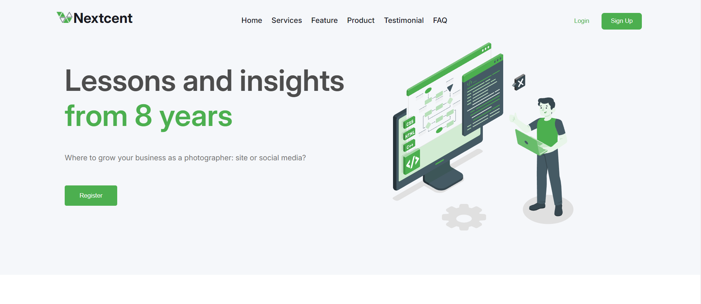
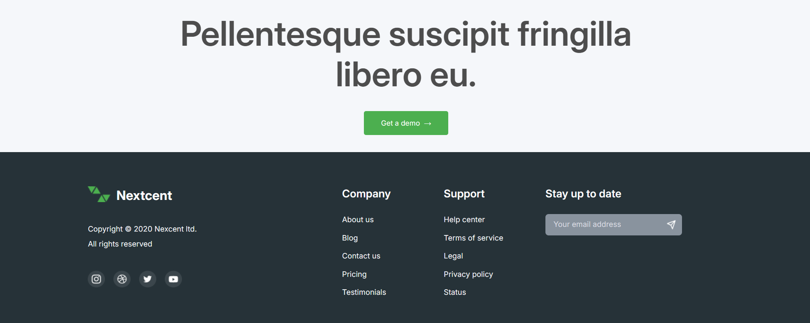

# Nextcent

**Nextcent** is a simple website Figma clone designed to help users create and prototype their design projects with ease. This tool is perfect for anyone looking to experiment with design concepts in a familiar, intuitive environment without the complexity of more advanced software.

## Features

- Intuitive layout that mimics the simplicity and ease of use of Figma.

- Clean design that helps users focus on their projects without distractions.

## Installation

1. Clone the repository:
   ```bash
   git clone "https://github.com/kundan761/Nextcent.git"
   ```
2. Open the `index.html` file in your web browser.

## Screenshots

### Homepage


### Footer


## License

This project is licensed under the MIT License.
